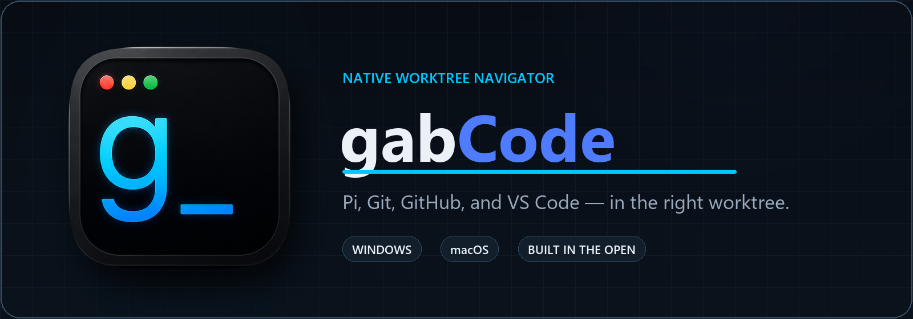
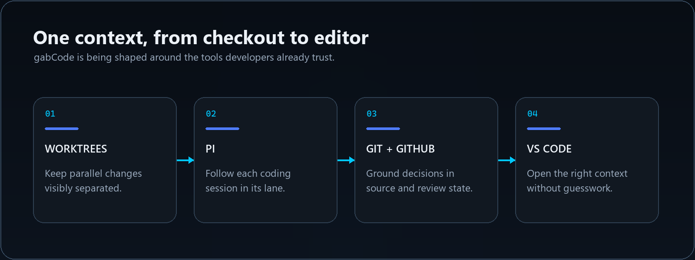

<p align="center">
  
</p>

<h1 align="center">gabCode</h1>

<p align="center">
  <a href="LICENSE"></a>
  
  
  
</p>

<p align="center">
  A native worktree navigator for developers using Pi, Git, GitHub, and VS Code.
</p>

gabCode is being designed and built in the open. The repository currently establishes independent native Windows and macOS clients, embedded terminal foundations, and reproducible developer-preview packaging while the broader worktree-navigation experience continues to take shape.

> [!IMPORTANT]
> gabCode is under active development. The native two-terminal foundation and unsigned-preview packaging are implemented today. Full worktree navigation, Git visibility, project associations, and VS Code handoffs remain planned milestones.

## Why gabCode

Parallel coding work becomes difficult when terminals, branches, reviews, and editor windows lose their shared context. gabCode is designed to make the active worktree obvious and keep the tools around it aligned—without introducing a second source of truth.

- **Native on each platform** — dedicated WPF and SwiftUI clients instead of a web shell.
- **Worktree-aware by design** — each coding session stays connected to the checkout it belongs to.
- **Grounded in developer tools** — the filesystem, Git, and read-only GitHub state remain authoritative.
- **Built for focused handoffs** — move from terminal context to review and editor context with less guesswork.

## Product direction



The [initial product requirements document](Documentation/design/gabcode-initial-prd.md) owns the product boundary, architecture direction, and planned milestones. gabCode is designed to observe source, pull requests, project documents, commits, and diffs without becoming a competing system of record.

## Native clients

| Windows | macOS |
| --- | --- |
| C#, .NET 10, and WPF | Swift, SwiftUI, and AppKit |
| Native Windows Terminal control foundation | Native SwiftTerm terminal foundation |
| Windows x64 developer-preview packaging | Apple Silicon developer-preview packaging |

The clients share product language, requirements, fixtures, and expected outcomes—not production runtime code. Each platform owns its native UI, terminal hosting, filesystem integration, and application lifecycle.

## Windows development

The Windows client uses C#, .NET 10, and WPF. The repository's `global.json` pins the required SDK feature band.

### Prerequisites

- Windows
- .NET SDK 10.0.302 or a later patch in the 10.0.3xx feature band

From the repository root:

```powershell
dotnet restore GabCode.slnx
dotnet build GabCode.slnx --configuration Release --no-restore
dotnet test GabCode.slnx --configuration Release --no-build
dotnet run --project src/GabCode.Windows/GabCode.Windows.csproj
```

Visual Studio is optional for this command-line workflow.

### Windows Terminal WPF dependency

The pinned Windows Terminal WPF control is evaluated separately from the current app bootstrap. Its dependency gate is **GO for Windows x64 integration with accepted limitations**. The upstream x64 Release build is reproducible with the v143 desktop and UWP C++ tools plus Windows SDK 10.0.22621.0.

See the [dependency record](Documentation/dependencies/windows-terminal-wpf.md) for the exact source pin, build prerequisites, accepted limitations, and integration boundary; do not substitute an unofficial package.

## macOS development

The macOS client uses SwiftUI, AppKit, and Swift. Its baseline is an Apple Silicon Mac running macOS 26.0 or later with Xcode 26.6, the macOS 26.5 SDK, and Swift 6.3.3.

### Prerequisites

- Apple Silicon Mac running macOS 26.0 or later
- Full Xcode 26.6 selected through `xcode-select` (not Command Line Tools)
- macOS 26.5 SDK and Swift 6.3.3 supplied by the selected Xcode installation

Verify the selected toolchain and discover the shared scheme:

```bash
xcode-select -p
xcodebuild -version
xcrun --sdk macosx --show-sdk-version
xcrun swift --version
xcodebuild -list -project src/GabCode.MacOS/gabCode.xcodeproj
```

Build and test the native app:

```bash
xcodebuild -project src/GabCode.MacOS/gabCode.xcodeproj -scheme gabCode -configuration Debug -destination 'platform=macOS' build
xcodebuild -project src/GabCode.MacOS/gabCode.xcodeproj -scheme gabCode -configuration Debug -destination 'platform=macOS' test
```

Open the project without embedding a machine-specific Xcode path:

```bash
open src/GabCode.MacOS/gabCode.xcodeproj
```

Select the shared `gabCode` scheme and **My Mac** destination, then press `Command-R`.

### Unsigned Apple Silicon preview packaging

The reproducible ad-hoc/non-notarized preview packaging surface is documented in [macOS unsigned developer preview](Documentation/release/macos-unsigned-preview.md). On the declared target Mac:

```bash
./eng/release/macos/build-preview.sh \
  0.0.1-preview.1 \
  artifacts/v0.0.1-preview.1
./eng/release/macos/test-preview.sh \
  artifacts/v0.0.1-preview.1/gabCode-0.0.1-preview.1-macos-arm64.dmg
```

### Cross-platform preview publication

After preparing the matching Windows MSI/evidence and macOS DMG/evidence pairs on their target machines and placing all four files under `artifacts/v<version>/`, publish from either platform:

```text
/release-preview x.y.z-preview.n
```

The command validates the prepared inputs and generates a public prerelease description from reviewed commit history before requesting the exact version as publication confirmation. See [the local preview workflow](Documentation/release/local-preview-workflow.md).

## Project documentation

- [Initial product requirements](Documentation/design/gabcode-initial-prd.md)
- [Independent native clients architecture](Documentation/design/independent-native-clients-prd.md)
- [Windows local preview workflow](Documentation/release/windows-unsigned-preview.md)
- [macOS local preview workflow](Documentation/release/macos-unsigned-preview.md)

## License

gabCode is available under the [MIT License](LICENSE).
